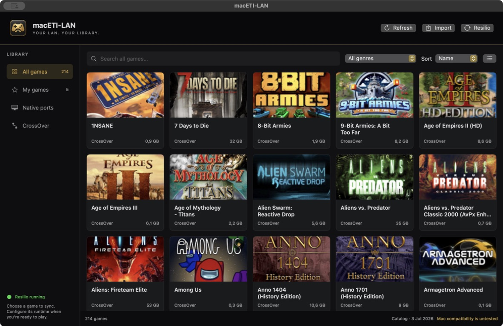
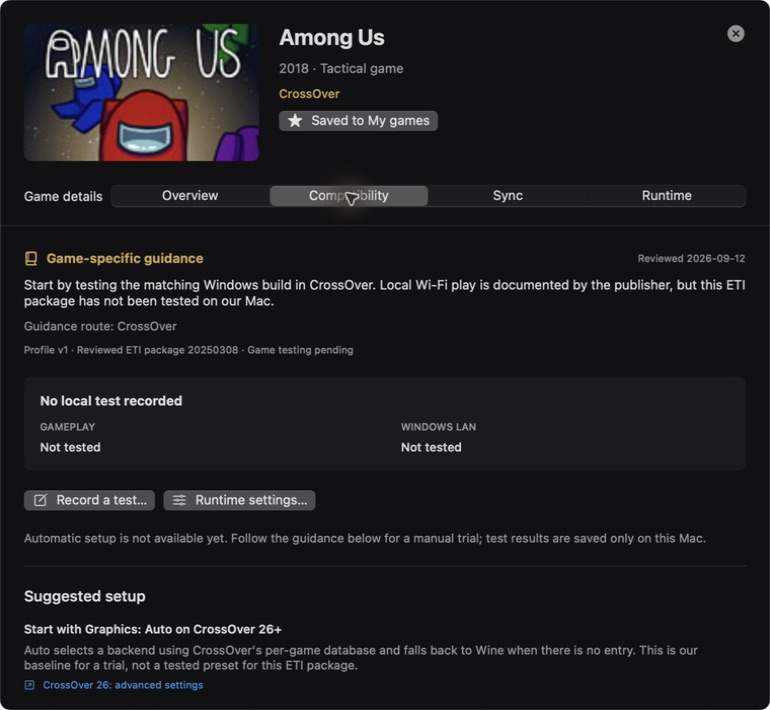

# macETI-LAN

A native macOS companion for the [ETI-LAN](https://www.eti-lan.xyz/?lang=en) game catalog. Browse the library, choose individual games for Resilio sync, configure CrossOver or a native engine, and keep track of compatibility experiments.

**Early preview · Apple Silicon · macOS 14 or later**

[Download](https://github.com/kaapyth0n/macETI-LAN/releases/latest) · [Installation guide](docs/INSTALL.md) · [Contribute](CONTRIBUTING.md) · [Issues](https://github.com/kaapyth0n/macETI-LAN/issues)



## What works today

- Browse the imported ETI catalog with covers, search, genre filters, grid/list views and sorting. The initial release was checked with a 214-game catalog.
- Save any title to **My games** and set up its individual read-only Resilio share.
- Create a CrossOver bottle from the game page, automatically prepare supported synced packages, or choose an existing bottle/native Mac app. Quake III defaults to the tested native ioquake3 route; other games default to CrossOver.
- Launch a prepared local game installation with its saved arguments and working folder.
- Read dated setup guidance, troubleshooting and Windows LAN checklists. Among Us, Left 4 Dead 2, FlatOut 2, Call of Duty 2, Quake III, classic Warcraft III and Rocket League have dedicated guidance; other entries get general advice.
- Record gameplay and Windows LAN results separately, alongside package/runtime versions and the test environment.

**The launcher is usable; game compatibility is still experimental.** No bundled profile certifies an ETI game or Mac–Windows multiplayer session. Resilio owns transfers and progress. Connecting a share requires its desktop app. Automatic setup covers the tested Among Us and Rocket League package revisions; other Windows games have bottle creation plus manual installation guidance. CrossOver itself must already be installed and activated.

No games, sync keys, catalog database, cover archive or third-party runtime are included. Resilio, CrossOver and any game/port must be obtained separately. This is an independent project, not an official ETI-LAN, Resilio or CodeWeavers product.

## Run the downloaded app

1. Download the **macos-arm64.zip** asset and checksum from [Releases](https://github.com/kaapyth0n/macETI-LAN/releases/latest).
2. Extract it and move **macETI-LAN.app** to Applications. The ZIP also contains instructions and optional Python setup helpers.
3. Open the app. This preview is ad-hoc signed, **not Developer ID signed or notarized**. If macOS blocks first launch, follow [Apple's per-app Open Anyway instructions](https://support.apple.com/en-gb/102445) after verifying that you trust the download.
4. Follow the [catalog setup guide](docs/INSTALL.md). A fresh installation starts with an empty library until you connect or import a catalog.

The app needs no Xcode or Python to open. Python 3 is used only by optional bootstrap/artwork helpers. CrossOver is needed only for Windows games; native ports use their own engines.

## Build from source

Use macOS 14+ with Swift 6 (Xcode 16+ or compatible Command Line Tools). The project uses SwiftUI, Foundation and system SQLite, with no third-party Swift package dependencies.

```sh
git clone https://github.com/kaapyth0n/macETI-LAN.git
cd macETI-LAN
swift test
bash scripts/build-app.sh
open dist/macETI-LAN.app
```

The build creates an app for the build Mac's architecture, with an icon, offline guidance and a bundled `maceti` CLI. Published binaries initially target **arm64**. Intel source builds are possible but have not been tested for game compatibility.

To create a distributable ZIP and SHA-256 checksum:

```sh
bash scripts/package-release.sh
```

## Sync, configure, play

**Sync:** open a game → **Sync** → copy its key and open Resilio → use **+ → Enter a key or link** → choose the displayed folder. Finish connecting and check transfer completion in Resilio. Saving or unsaving **My games** never changes subscriptions.

**Set up:** after syncing, choose **Set up game** on Among Us or Rocket League. The app creates a dedicated Windows 10 bottle, extracts the game and saves its launch settings. For other Windows games, **Create bottle only** saves a fresh bottle; follow Compatibility for the remaining installation. Existing configured games are preserved. See [automatic setup](docs/SETUP.md) for supported revisions and recovery.

**Runtime:** manual settings remain available for existing bottles and executables; native mode accepts a Mac executable or `.app`. Arguments are entered one per line and passed directly, without shell expansion. Use a writable local installation for play, keeping settings/saves separate from the synced distribution package.

**Compatibility:** consult the sourced guidance and record an actual test. A successful launch does not establish LAN compatibility. The page distinguishes reaching a menu, gameplay, joining a Windows host and completing a LAN session. Historical results are flagged when the package or saved runtime configuration changes.

The [Warcraft III setup notes](docs/WARCRAFT-III.md) cover the tested Frozen Throne build, OpenGL fix for black terrain, full-screen setup and Bonjour discovery. FlatOut 2's in-app guide includes the verified resolution setup. Among Us and the older synced Rocket League build have user-confirmed LAN play with the Windows group using CrossOver 26.3.0. Quake III also joined a Windows 1.32 LAN server using native ARM64 ioquake3; see the [native setup notes](docs/QUAKE-III.md). Left 4 Dead 2 now has an observed local gameplay test after an [overlay fix](docs/LEFT-4-DEAD-2.md); Windows joining remains untested. See the [observed results](docs/COMPATIBILITY.md#observed-game-results) for the tested builds, settings and limits.



## Command line

After building, use `.build/debug/maceti` or `.build/release/maceti`. The downloaded app also includes `/Applications/macETI-LAN.app/Contents/MacOS/maceti`.

```sh
.build/debug/maceti doctor
.build/debug/maceti import /path/to/game.db
.build/debug/maceti catalog --json
.build/debug/maceti catalog --saved
.build/debug/maceti plan factorio quake3 --json
.build/debug/maceti save factorio
.build/debug/maceti copy-key factorio
.build/debug/maceti compatibility flat2
.build/debug/maceti setup amongus
.build/debug/maceti setup factorio --bottle-only
.build/debug/maceti launch factorio --dry-run
```

`catalog` and `plan` cover the full catalog by default. `--saved` filters My games. `copy-key` copies only the selected read-only key and never prints it. `launch --dry-run` validates and displays the command without executing it. Run `maceti help` for all commands.

`--sync-root /path/to/library` overrides the Resilio root for that CLI invocation. The desktop app currently uses the default root.

## Local data and privacy

| Location | Contents |
| --- | --- |
| `~/Resilio Sync/macETI-LAN/eti_launcher/` | The connected ETI launcher share |
| `~/Resilio Sync/macETI-LAN/<game-id>/` | Individually connected packages |
| `~/Library/Application Support/macETI-LAN/` | Private catalog snapshot, receipts, launcher key, preferences, test history, setup tool/logs and imported artwork |

The catalog contains sync access keys. **Do not upload your catalog, Resilio state, keys or application-support directory to public reports.** Test history may contain local paths and anything typed into notes. The launcher keeps these records locally and has no telemetry or report-upload feature.

The repository excludes runtime data, downloaded game files and build output. Tests create synthetic databases and keys in temporary directories. The app validates catalog structure and bounds, uses atomic private writes and never executes catalog strings. More detail: [compatibility architecture](docs/COMPATIBILITY.md).

## Contributing and roadmap

Contributions are welcome, particularly reproducible game reports, native engine adapters, tested setup recipes, and improvements to Resilio integration and first-run setup. Read [CONTRIBUTING.md](CONTRIBUTING.md) before adding a profile or opening a PR.

Near-term work: validate the priority games against Windows hosts, add tested dependency/setup recipes for more games, and investigate a supported Resilio control interface. Developer ID signing and notarization would simplify distribution.

## License and attribution

Project code is [MIT licensed](LICENSE). The original app icon was generated for this project. Game artwork visible in screenshots belongs to its respective owners and is not included as a reusable asset library. See [third-party notices](THIRD_PARTY_NOTICES.md).
